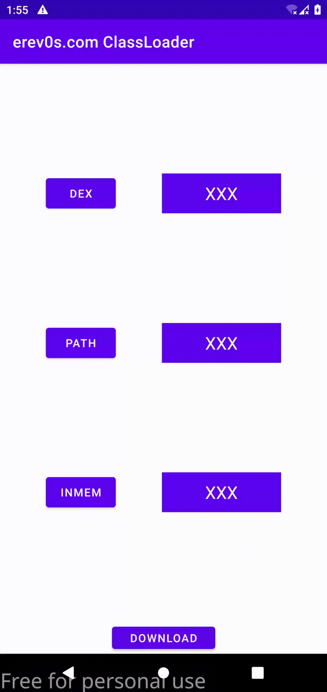

# ClassLoaderExample

This repository is accompanying the blog post https://erev0s.com/blog/3-ways-for-dynamic-code-loading-in-android/

It showcases 3 different methods to dynamically load classes in Android.
There are three .dex files in the assets directory which contain each one a class with unique name and within that class a function to return a random number.

The three buttons in the app are calling each one a different method to load the corresponding .dex file.

